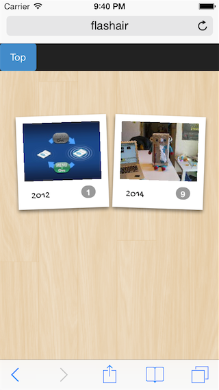
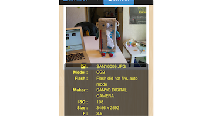

Flashair
========

FlashAir Picture Viewer
-----------------------

無線LAN機能を搭載したSDHCメモリーカード [FlashAir](https://flashair-developers.com/ja/) に対応したWebアプリケーションです。

FlashAir上の`/SD_WLAN/`フォルダに格納する事で利用できます。

### 機能
- 日付ごとに写真を表示
- JPEG画像は、EXIF情報を表示可能

### インストール方法
1. `dist/`に格納されているファイル一式をFlashAir上の`/SD_WLAN/`フォルダに格納する

### 表示サンプル

 

